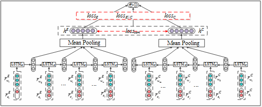

# Sentiment classification
## Introduction  
You can use this model to deal with sentiment classification task.   
We design two LSTMs for forward and backward sequence learning, and we also design three semantic loss using forward,backward and both
sequence to classify the sentence. Meanwhile, we design a sentiment loss by minimizing the difference between the forward and backward representations.
## How to use  
First, you should install python 2.7 and theano 0.9.  
You should prepare your data with pkl format.   We provide a simple function `preprocess` in lstm.py. You can use this function to prepare you own data.
```bash
python lstm.py
```
## Model 


## Paper
You can read our paper for the Original version of our lstm model, which is used fro cross-language sentiment classification.
* Jointly learning bilingual sentiment and semantic representations for cross-language sentiment classification
